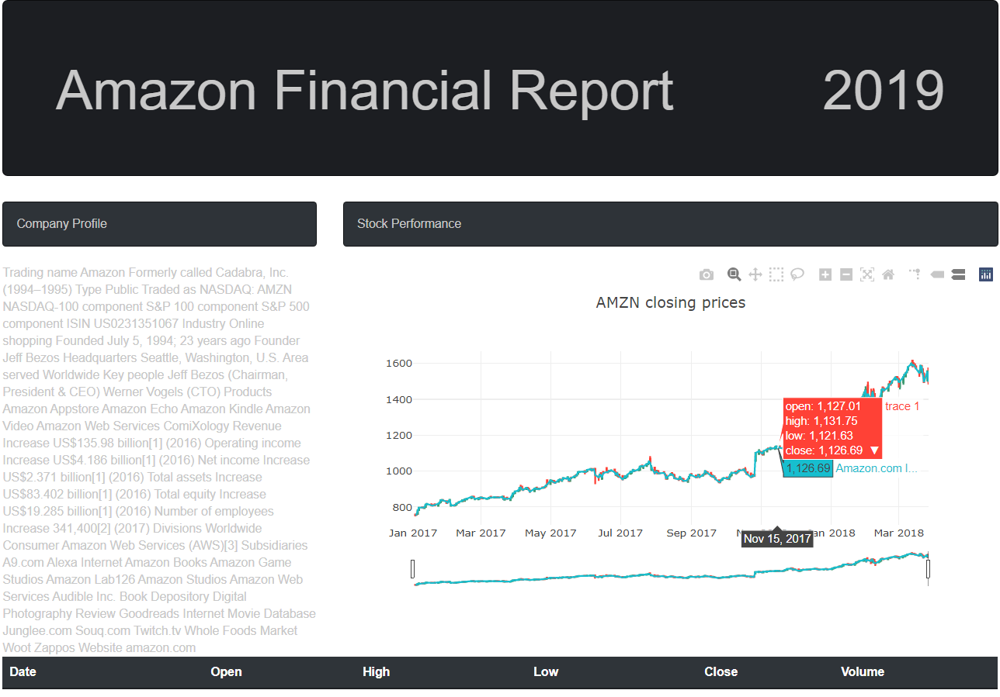

# Stock-Report

## **Objective:**
Provide an interactive stock report webpage using javascript and API calls from quandl. The javascript needs to be tailored to how quandl's information is distributed through the API. Everything is then displayed on an html page with css and bootstrap implamentations.

## **Tools:**
1.	HTML
2.	JavaScript
3. 	Quandl API

## **Screenshot:**

